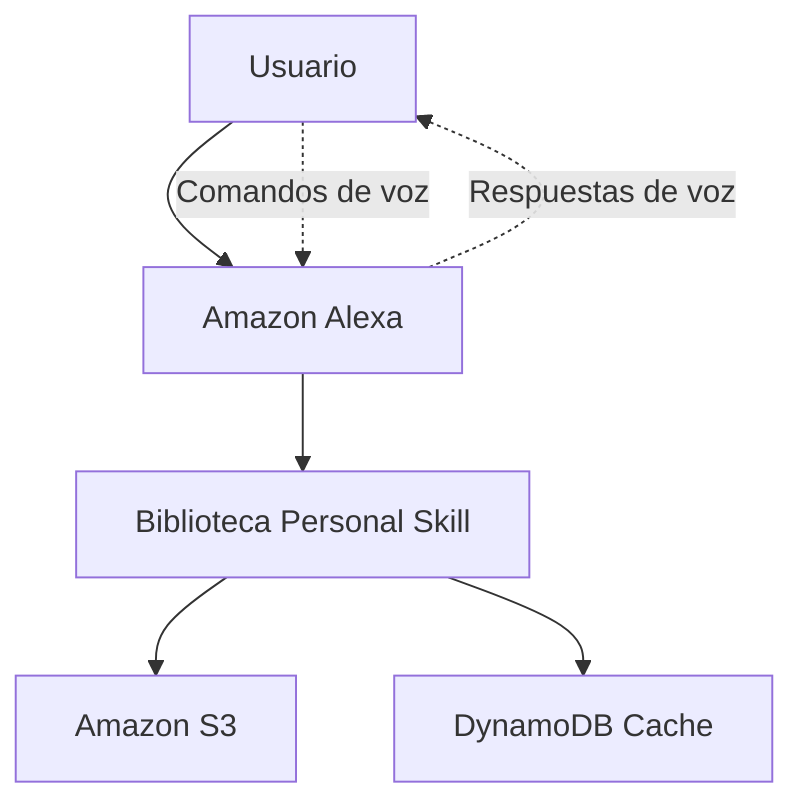
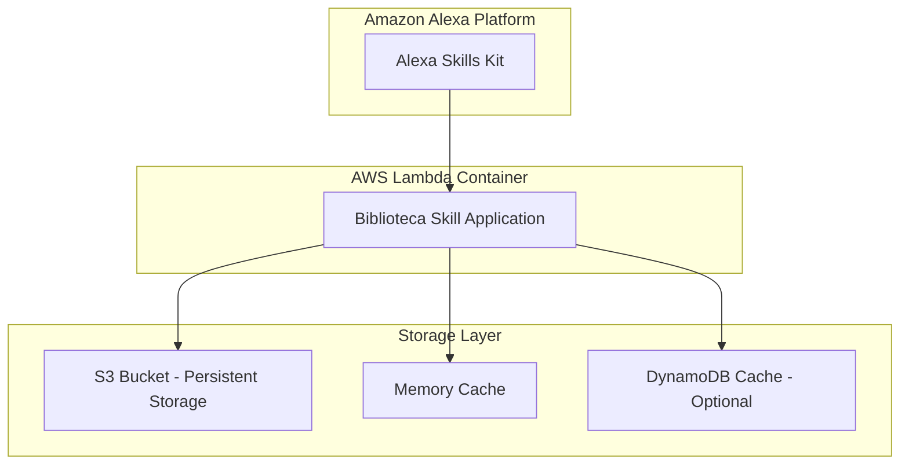
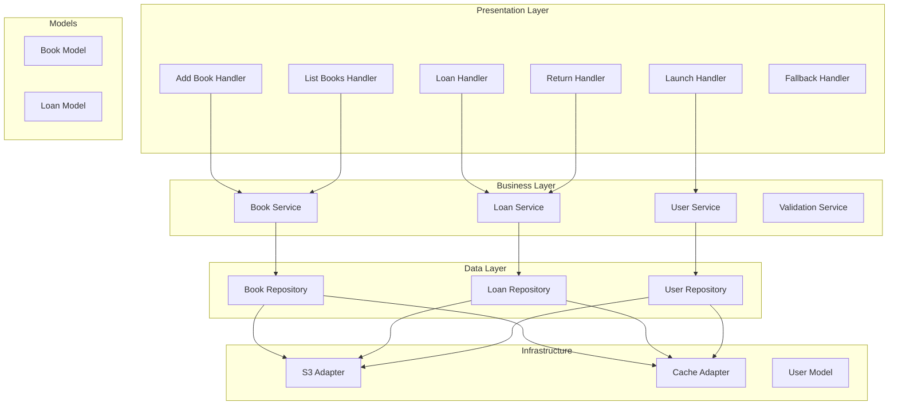

# Diseño de Software - Sistema de Gestión de Biblioteca Personal

**Versión:** 1.0

**Autor(es):** Equipo de Desarrollo

**Fecha:** 22 de Septiembre, 2025

**Historial de revisiones:**

| Versión | Fecha      | Autor(es) | Cambios Realizados              | Aprobado por      |
| -------- | ---------- | --------- | ------------------------------- | ----------------- |
| 0.1      | 2025-09-22 | Equipo    | Creación inicial del documento | Líder del equipo |
|          |            |           |                                 |                   |

## 1. Introducción (Caso de uso)

### Descripción general del sistema

El Sistema de Gestión de Biblioteca Personal es un Alexa Skill que permite a los usuarios gestionar de manera intuitiva su colección personal de libros mediante comandos de voz. El sistema facilita el control de inventario, préstamos y devoluciones de libros físicos.

### Objetivo del documento

Definir la arquitectura y diseño del sistema aplicando principios SOLID y los cuatro pilares de la POO, migrando desde una implementación monolítica hacia una estructura modular y mantenible.

### Alcance

**Incluye:**

* Gestión de inventario de libros (agregar, listar, buscar)
* Sistema de préstamos y devoluciones
* Persistencia de datos en S3
* Interfaz de voz natural con diálogos conversacionales
* Paginación de resultados
* Historial de transacciones
* Eliminación de libros (funcionalidad adicional)

**No incluye:**

* Gestión de usuarios múltiples
* Integración con servicios externos de libros
* Funciones de compra/venta

### Actores principales

* **Usuario primario:** Propietario de la biblioteca personal
* **Sistema Alexa:** Interfaz de interacción vocal
* **Amazon S3:** Servicio de persistencia de datos

### Casos de uso relevantes

1. Agregar libros mediante diálogo conversacional
2. Consultar inventario con paginación
3. Registrar préstamos con fechas límite
4. Procesar devoluciones
5. Consultar historial de movimientos
6. Eliminar libros de la colección

---

## 2. Problem Statement (Declaración del problema)

### Contexto

El código actual está implementado como un monolito en un único archivo `lambda_function.py` de más de 1000 líneas, donde toda la lógica de negocio, manejo de datos, y control de interfaz están mezclados sin separación de responsabilidades.

### Problemas específicos

* **Mantenibilidad:** Difícil de modificar y extender debido al acoplamiento alto
* **Testabilidad:** Imposible realizar pruebas unitarias efectivas
* **Escalabilidad:** Agregar nuevas funcionalidades requiere modificar múltiples secciones
* **Legibilidad:** Código complejo y difícil de entender
* **Reutilización:** Lógica duplicada en múltiples handlers

### Impacto de no resolverlos

* Tiempo de desarrollo incrementado exponencialmente
* Mayor probabilidad de bugs al hacer cambios
* Dificultad para onboarding de nuevos desarrolladores
* Imposibilidad de implementar CI/CD efectivo

### Restricciones del entorno

* Debe funcionar en AWS Lambda
* Compatibilidad con Alexa Skills Kit
* Límites de tiempo de ejecución de Lambda (15 minutos máx)
* Restricciones de memoria y almacenamiento temporal

---

## 3. Requerimientos funcionales

| ID    | Descripción                     | Actor   | Prioridad | Criterios de aceptación                                              |
| ----- | -------------------------------- | ------- | --------- | --------------------------------------------------------------------- |
| RF-01 | Agregar libros mediante diálogo | Usuario | Alta      | El sistema debe solicitar título, autor y tipo en pasos secuenciales |
| RF-02 | Listar libros con paginación    | Usuario | Alta      | Mostrar máximo 10 libros por página con navegación                 |
| RF-03 | Buscar libros por título/autor  | Usuario | Media     | Encontrar coincidencias parciales en títulos y autores               |
| RF-04 | Registrar préstamos             | Usuario | Alta      | Capturar libro, persona y fecha límite automática                   |
| RF-05 | Procesar devoluciones            | Usuario | Alta      | Actualizar estado y registrar en historial                            |
| RF-06 | Consultar préstamos activos     | Usuario | Media     | Mostrar libros prestados con fechas y personas                        |
| RF-07 | Ver historial completo           | Usuario | Baja      | Acceder a todas las transacciones pasadas                             |
| RF-08 | Eliminar libros                  | Usuario | Media     | Remover libros de la colección con confirmación                     |
| RF-09 | Sincronizar estados              | Sistema | Alta      | Mantener consistencia entre libros y préstamos                       |
| RF-10 | Persistir datos                  | Sistema | Alta      | Guardar/recuperar datos desde S3 automáticamente                     |

---

## 4. Requerimientos no funcionales

| ID     | Atributo       | Descripción                 | Métricas / criterios cuantitativos     |
| ------ | -------------- | ---------------------------- | --------------------------------------- |
| RNF-01 | Rendimiento    | Respuesta rápida en Lambda  | < 3 segundos por operación             |
| RNF-02 | Escalabilidad  | Soporte múltiples libros    | Hasta 1000 libros por usuario           |
| RNF-03 | Disponibilidad | Funcionamiento continuo      | 99.9% uptime                            |
| RNF-04 | Usabilidad     | Interacción natural por voz | Comprensión > 90% comandos válidos    |
| RNF-05 | Mantenibilidad | Código modular y testeable  | Cobertura de pruebas > 80%              |
| RNF-06 | Seguridad      | Datos de usuario protegidos  | Encriptación en S3, acceso por usuario |

---

## 5. Arquitectura / Diseño – C4 Diagrams

### Descripción general de la arquitectura

El sistema sigue una arquitectura por capas con separación clara de responsabilidades:

* **Capa de Presentación:** Handlers de Alexa
* **Capa de Lógica de Negocio:** Services y Controllers
* **Capa de Datos:** Repositories y Models
* **Capa de Infraestructura:** Adapters y Utilities

### Diagramas C4

#### Diagrama de Contexto (Level 1)

#### Diagrama de Contenedores (Level 2)

#### Diagrama de Componentes (Level 3)

**Enlaces a diagramas detallados:**

<!-- * [Repositorio GitHub - Diagramas C4](https://github.com/team/biblioteca-skill/docs/architecture) -->

---

## 6. Diseño VUI / Diagramas de flujo de voz

### Objetivo del diseño VUI

Crear una experiencia de voz natural e intuitiva que simule una conversación con un bibliotecario personal, minimizando la fricción y maximizando la comprensión.

### Estilo, tono y lenguaje de voz

* **Tono:** Amigable, servicial y profesional
* **Personalidad:** Bibliotecario experto pero accesible
* **Lenguaje:** Español mexicano, formal pero cercano
* **Respuestas:** Variadas para evitar repetición, confirmaciones claras

### Escenarios de uso por voz

* **Cuándo:** En casa, durante organización de libros, antes/después de préstamos
* **Dónde:** Biblioteca personal, estudio, sala de estar
* **Dispositivos:** Echo Dot, Echo Show, dispositivos móviles con Alexa
* **Entorno:** Silencioso a moderadamente ruidoso

### Diagramas de flujo de conversación DIAGRAMA

#### Flujo Principal - Agregar Libro DIAGRAMA

#### Flujo - Eliminar Libro (Nuevo) DIAGRAMA

#### Flujo - Manejo de Errores DIAGRAMA

### Consideraciones especiales

* **Latencia:** Respuestas en < 2 segundos para mantener fluidez
* **Reconocimiento:** Manejo de variaciones en pronunciación de títulos
* **Fallbacks:** Múltiples niveles de clarificación antes de cancelar
* **Context:** Mantener contexto durante diálogos multi-turno
* **Confirmaciones:** Siempre confirmar acciones destructivas

**Enlaces a diagramas detallados:**

* [Figma - Flujos VUI Completos](https://figma.com/file/biblioteca-vui-flows)

---

## 7. Secciones adicionales

---

## 8. Apéndices

---

## 9. Revisión y mantenimiento del documento

### Historial de Revisión / Mantenimiento

| Versión | Fecha    | Autor(es)               | Cambios Realizados                                      | Aprobado por           | Comentarios adicionales               |
| -------- | -------- | ----------------------- | ------------------------------------------------------- | ---------------------- | ------------------------------------- |
| 0.1      | xxxxxxxx | Equipo completo         | Creación inicial del documento; análisis del monolito | Líder del equipo      | Primer borrador con casos de uso      |
| 0.5      | xxxxxxxx | Desarrollador principal | Incorporación de diagramas C4 y arquitectura           | Arquitecto de software | Revisión de patrones aplicados       |
| 0.8      | xxxxxxxx | UX Designer             | Adición de flujos VUI y diagramas de voz               | Product Owner          | Validación de experiencia de usuario |
| 1.0      | xxxxxxxx | Equipo completo         | Documento aprobado con apéndice de refactorización    | Líder del equipo      | Versión final para implementación   |
